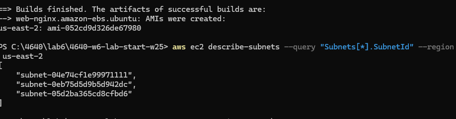

# 4640-w6-lab-start-w25

I was able to create the AMI as seen below; however I was not able to create an instance using the ami. I think this is a result of improper aws cli credentials, as I was getting an error using my outdated credentials and had to generate a new one. This IAM user i created for the lab wont let me upload an ssh key or generate one, resulting in me not being able to ssh into an instance even when creating it through aws cli or terraform:

